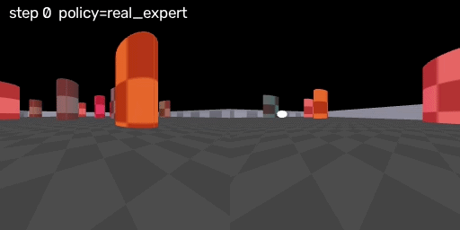
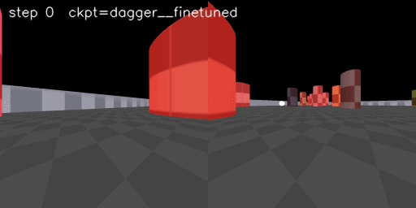
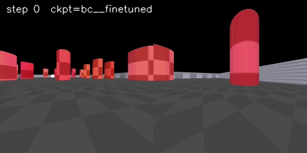

# FLYNN — Robot Navigation with a Fruit-Fly Brain (Reproduction + BC Comparison)

[](https://arxiv.org/abs/2607.00025)


This repository is a **reproduction of the paper**

> **FLYNN: Robust Neural Network for Robot Navigation using Fly Brain Topology**
> Benquan Wang, Jingdao Chen — arXiv:[2607.00025](https://arxiv.org/abs/2607.00025) (cs.RO), 2026

and **extends it** with a head-to-head comparison of three ways of training the same connectome-constrained
agent: **DAgger**, plain **Behavior Cloning (BC, imitation learning)**


---

## The idea :

Deep networks are brittle: they degrade when the environment changes or when a sensor fails. Biological brains
are much more tolerant. FLYNN (*FLY connectome Neural Network*) tests whether **copying the wiring diagram of a
real fly brain** into an RNN gives an artificial agent some of that robustness.

A leaky RNN whose **recurrent weights are the real *Drosophila* adult-brain connectome** (FlyWire FAFB v783)
drives a **two-wheeled robot with two cameras** through randomly generated obstacle courses in MuJoCo. According to
the paper, FLYNN reaches performance comparable to hand-crafted networks with similar parameter counts, while
showing better resistance to out-of-distribution (OOD) data and tolerance to sensory loss — it remained
functional even with total vision loss, where the hand-crafted networks largely failed.

## The fruit fly behind the model

**Species:** *Drosophila melanogaster*, the common fruit fly — one of the most studied model organisms in
neuroscience and genetics.

**Why the fly?** Its brain is small enough to map completely, yet it supports flight, visual navigation, olfaction,
learning and memory. In recent years its whole brain has been reconstructed from electron-microscopy images at
**synaptic resolution**, producing a *connectome*: a graph in which every neuron is a node and every synapse
is an edge.

**Which dataset?** [FlyWire](https://flywire.ai/) — the **FAFB v783** release of the adult female fly brain
(Full Adult Fly Brain EM volume). The repo uses its neuron-to-neuron **edge list** (~261 MB, downloaded once with
`scripts/download_connectome.py`). The connectome contains on the order of
a hundred thousand neurons and tens of millions of synapses.

## How the agent works

```
 left cam ─┐                                         ┌─> wheel commands
           ├─> virtual retina ─┐                     │
 right cam ┘                   ├─> input scale ─> Connectome leaky RNN ─> heads ─┤
 wind / state ─> wind MLP ─────┘     (FlyWire FAFB v783 recurrent weights)       └─> (aux outputs)
```

* **Core:** `LeakyConnectomeRNNCell` — a sparse, memory-efficient leaky RNN whose recurrent matrix is the connectome.
* **Agent:** `ConnectomeAgent` — virtual retina + wind MLP + RNN + output heads.
* **Environment:** `MuJoCoTwoCamEnv` — a gymnasium environment with a two-wheeled robot, two cameras and
  procedurally generated obstacle arenas (checker or realistic texture).
* **Expert (teacher):** `PlannerAnalyticTeacher` — VFH\*+A\* planning with a Stanley-style path follower.

## What this repo adds: DAgger vs BC 

The same agent is trained with three different algorithms, under three regimes, and then evaluated under
identical conditions.


**Evaluation conditions**

* **In-distribution** — same arena statistics as training.
* **Occluded vision** — `full`, `left` camera only, `right` camera only, `blind` (both cameras off).
* **Out-of-distribution** — different obstacle density, different arena size, and an unseen texture.

## Demo videos

> Videos are stored in [`assets/videos/`](assets/videos/). Replace the file names below with your own recordings.

### Expert and trained agents

<table>
  <tr>
    <th>Expert (VFH*+A*)</th>
    <th>FLYNN — DAgger</th>
    <th>FLYNN — BC</th>
  </tr>
  <tr>
    <td></td>
    <td></td>
    <td></td>
  </tr>
</table>

## Quick start

```bash
python -m venv .venv && source .venv/bin/activate
pip install -e .                       # 
python scripts/download_connectome.py  # one-off: ~261 MB FAFB v783 edge list -> data/connectomes/...

```


## Usage

**Train with DAgger** (hyperparameters are at the top of `src/flynn/training/dagger.py`):

```bash
python scripts/train_dagger.py
```

**Compare DAgger / BC (+ untrained baseline), evaluate, and plot:**

```bash
python scripts/run_experiments.py --help
```

**Re-draw plots from saved results:**

```bash
python scripts/plot_results.py
```

**Videos of the analytic expert:**

```bash
python scripts/record_expert_videos.py
```

**Videos of a checkpoint:**

```bash
python scripts/eval_checkpoint_videos.py outputs/checkpoints/bc__finetuned.pt
```

**One video per vision condition (full / left / right / blind):**

```bash
python scripts/eval_vision_conditions.py outputs/checkpoints/dagger__finetuned.pt
```

**Out-of-distribution evaluation:**

```bash
python scripts/eval_ood.py
```


## Citation

If you use this code, please cite the original paper:

```bibtex
@article{wang2026flynn,
  title   = {FLYNN: Robust Neural Network for Robot Navigation using Fly Brain Topology},
  author  = {Wang, Benquan and Chen, Jingdao},
  journal = {arXiv preprint arXiv:2607.00025},
  year    = {2026},
  url     = {https://arxiv.org/abs/2607.00025}
}
```

## License & acknowledgements

* The model, environment, planner and DAgger code come from the official release
  [ben-gitdev/fly-gym](https://github.com/ben-gitdev/fly-gym) (MIT, © Benquan Wang).
* The BC  / training-regime / OOD-evaluation parts were added on top of it.
* Connectome data: [FlyWire](https://flywire.ai/) FAFB v783 (check FlyWire's terms for data use and citation).

* This repository is an independent reproduction and is not affiliated with the paper's authors.